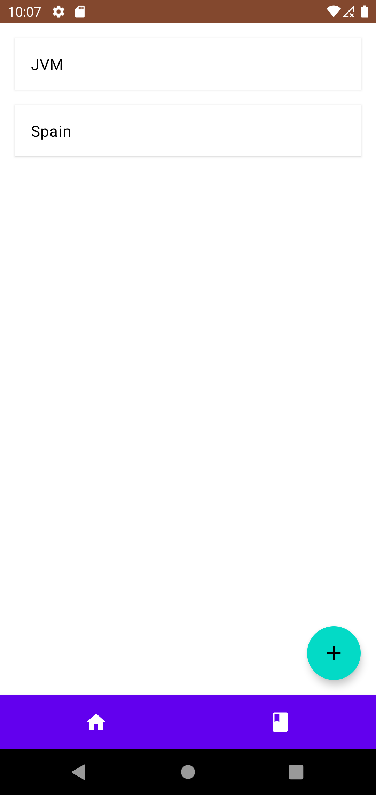

# HNNotify

**HNNotify** is my personal playground, the intend of this project is to test new technologies and approaches to build
android applications.
It started in 2017 where I tested the idea of building an app in Kotlin + RxJava that notified users when a new post
appeared in Hacker News (HN) with a given word.
At some point in time I moved to coroutines instead to test them.
In 2020 I moved most of the domain layer to an small backend application written in Kotlin using Spring Boot, and
moved most of the UI to Jetpack Compose, this work can be seen in the branch v2.

## v1 architecture

In the main branch you can find a layered architecture composed of 4 layers, from bottom to top:
- infrastructure (or core), this layer contains all that supplies of core functionalities to the rest of the modules,
it includes things like network, logging, localization, database and di.
- data, this layer contains the repositories and the DTOs of the different sections of the app, it also contains some
of the entities (in hindsight this is a controversial choice, nowadays I think the data layer shouldn't know anything
about your domain entities)
- domain, this layer contains the different use cases and some utility classes
- presentation, this layer contains all the UI code, from the ViewModels to the activities and views.

For the presentation layer I wanted to test the Jetpack ViewModel instead of the usual Presenter (but in the same role),
the state is stored in the ViewModel as BroadcastChannel (nowadays you would use MutableStateFlow, but is the same
concept).

Some UI action will create a new state from the old one changing some values and that would send a new state element to
the channel, the view is subscribed to this channel mapping this state to some POJO (viewdata, I was used to call these
view models, but Google took that from me :P) and then update the view.

This pattern is very very similar to the one I used later when migrating to Compose (explained below)

# v2 architecture

In v2 I've made several changes, the biggest ones are:
- Most of the logic has been moved to the backend, the domain logic is now very very thin
- I've arranged the packages per "screen" with some core modules (navigation, application)
- The UI layer now uses Jetpack Compose (I must update to beta now that is out :P)

# v1 screenshots

# v2 screenshots

